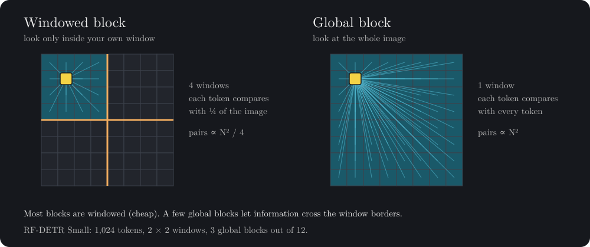
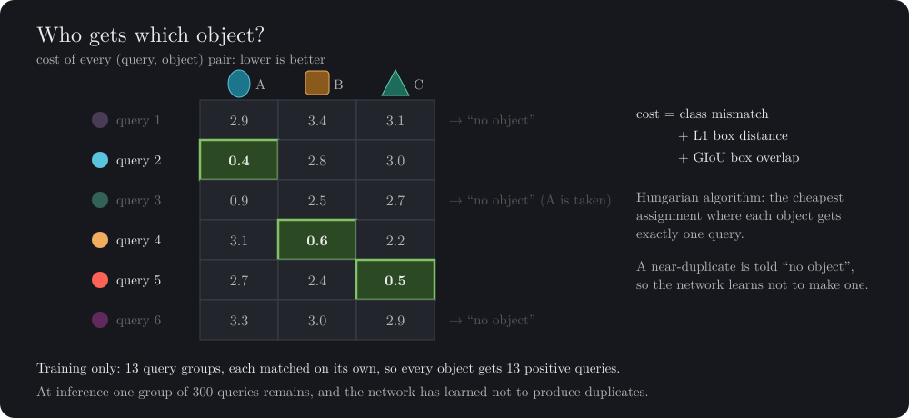

# How RF-DETR Works

!!! tip "Key Takeaways"

    - RF-DETR treats detection as a set of answers to a fixed number of learned questions (queries), so it never produces duplicate boxes and needs no non-maximum suppression (NMS)
    - Its backbone is DINOv2, a vision transformer pretrained without labels, which is why it adapts well to small and unusual datasets
    - Windowed attention keeps the backbone cheap, and deformable attention lets each query read only a few points of the image instead of all of them
    - Training uses one-to-one Hungarian matching, which is what teaches the model not to produce duplicates
    - One training run produces a whole family of models; the Nano, Small, Medium, and Large checkpoints are points on that run's accuracy–latency curve

This page builds the idea up from scratch, one picture at a time. No prior knowledge of transformers is assumed. If you only want numbers, go to [Benchmarks](benchmarks.md); if you want to train, go to [Train Model](train/index.md).

## A question to start with

Look at a photo of a street. You see a cyclist, two cars, and a dog. You did not consider ten thousand possible boxes and then throw most of them away. You just *saw* four things.

How do you get a computer to give that kind of answer: a short list, one entry per object, and nothing else?

There are two broad philosophies.

{ loading=lazy }

### Guess everywhere, then clean up

Classic convolutional detectors, such as YOLOv8 and YOLO11, slide a network over the image and make a prediction at every cell of a grid, often at several scales. Each cell says "if there is an object centered near me, here is its box and its class." Most cells see nothing, a few see something, and several neighboring cells usually see *the same* thing.

The result is thousands of candidate boxes with heavy overlap. A hand-written post-processing step, non-maximum suppression (NMS), then walks through them: keep the highest-scoring box, delete every other box that overlaps it by more than some threshold, repeat.

This works well and is very fast on a GPU. It also has a few properties worth noticing:

- NMS is not learned. Its IoU threshold is a knob you tune, and the right value changes between datasets. Too low and you delete one of two people standing close together; too high and you keep duplicates.
- Its cost depends on how many candidates survive the score filter, so a crowded scene takes longer than an empty one.
- It sits outside the network, so the model is never trained to avoid duplicates. It is trained to produce them and rely on the cleanup.

### Ask a fixed number of questions

In 2020, [DETR](https://arxiv.org/abs/2005.12872) proposed a different framing: detection as *direct set prediction*. The model holds a small, fixed set of learned **queries**. Think of each one as a question: "Is there an object I should be responsible for? If so, where, and what is it?" Every query answers once. A query with nothing to report answers "no object" (written ∅).

During training, each real object is assigned to exactly one query, and every other query is told the right answer for it was ∅. A query that tries to describe an object already claimed by another query is penalized. The network therefore learns not to produce duplicates, which removes the need for NMS and for hand-designed anchor boxes.

!!! question "Pause and ponder"

    If two queries both see the same cat, and only one of them is allowed to say "cat", how does the second one know to stay quiet? The queries need a way to talk to each other. Keep this in mind; it is exactly what the decoder's self-attention does.

The original DETR had two well-known weaknesses: it needed very long training schedules, and it struggled with small objects. [Deformable DETR](https://arxiv.org/abs/2010.04159) addressed both and reached better accuracy with 10 times fewer training epochs. RF-DETR inherits that fix, and adds several of its own to make the idea run in real time.

## Following one image through RF-DETR

Let us follow a single image through RF-DETR Small. Each step below is one box in this picture.

{ loading=lazy }

### Step 1: from pixels to tokens

The image is resized to a square, 512 × 512 pixels for RF-DETR Small, and cut into 16 × 16 pixel patches. That gives a 32 × 32 grid, so 1,024 patches. Each patch is flattened into a vector called a **token**. From here on the model never sees pixels, only this list of tokens and their positions.

Bigger models use larger inputs, and therefore more tokens:

| Model          | Resolution [px] | Patch size [px] | Tokens [-] | Decoder layers [-] | Queries [-] |
| :------------- | :-------------: | :-------------: | :--------: | :----------------: | :---------: |
| RF-DETR Nano   |       384       |       16        |    576     |         2          |     300     |
| RF-DETR Small  |       512       |       16        |   1,024    |         3          |     300     |
| RF-DETR Medium |       576       |       16        |   1,296    |         4          |     300     |
| RF-DETR Large  |       704       |       16        |   1,936    |         4          |     300     |

More tokens means finer detail, which helps with small objects, at the cost of more computation.

### Step 2: a backbone that already knows what things look like

The tokens go through the backbone, a vision transformer initialized from [DINOv2](https://arxiv.org/abs/2304.07193). DINOv2 was pretrained without any labels, on a large curated image collection, to produce general-purpose visual features. Before RF-DETR has seen a single bounding box, its backbone already separates fur from metal, edges from texture, and foreground from background.

This matters most when your dataset is small or unusual. The RF-DETR paper reports that initializing from DINOv2 "significantly improves detection accuracy on small datasets" compared with the backbone LW-DETR used.

A transformer block lets every token compare itself with every other token. That is powerful, because a patch on a car's wheel can directly consult a patch on its roof, but the cost grows with the square of the number of tokens. RF-DETR keeps it affordable with **windowed attention**:

{ loading=lazy }

Most blocks split the token grid into 2 × 2 windows, and each token only looks inside its own window. That cuts the number of comparisons per block by a factor of four. A few blocks stay global, so information can still cross window borders. In RF-DETR Small, 3 of the 12 blocks are global.

!!! note "Compare with a convolution"

    A 3 × 3 convolution only looks at immediate neighbors. A convolutional network sees the whole image only after many layers, as its receptive field slowly grows. A global attention block gets there in one step. This is one reason transformer detectors handle context well, for example recognizing a small object from what surrounds it.

### Step 3: the projector

Features are taken from four depths of the backbone (after blocks 3, 6, 9, and 12). Early blocks carry fine, local detail; late blocks carry more abstract meaning. The **projector** fuses the four into a single feature map at stride 16, using small convolutional C2f blocks with LayerNorm. This fused map is called the **memory**: it is what the decoder will read from.

Two details here are easy to miss:

- **There is no separate transformer encoder.** DETR and Deformable DETR run a stack of encoder layers after the backbone. In RF-DETR, as in LW-DETR, the pretrained ViT and the projector do that job.
- **LayerNorm instead of BatchNorm.** The paper uses layer norm in the projector so that training with gradient accumulation on consumer GPUs behaves correctly; batch norm statistics depend on the per-step batch size.

### Step 4: choosing where to look

Now we need queries. Instead of starting from blank questions, RF-DETR uses a **two-stage** scheme. Every memory token makes a quick guess: a class score and a box around itself. The 300 tokens with the highest scores become the starting queries, each already carrying a rough box.

So a query does not start with "is there anything out there?" It starts with "I think there is something like a dog near here; let me check."

### Step 5: the decoder, where queries look and negotiate

The decoder is a short stack of layers (three for Small). Each layer does three things to every query:

1. **Self-attention between queries.** Queries compare notes. This answers the "pause and ponder" question above: two queries that latched onto the same dog can see each other, and over training they learn that only one of them should claim it.
2. **Cross-attention into the memory.** Each query reads image evidence. Here is the second efficiency trick.
3. **A small correction to the box.** The query predicts how to shift and resize the box it received.

{ loading=lazy }

In the original DETR, cross-attention let every query read every location of the feature map. RF-DETR uses **deformable attention**: each query predicts a few sampling offsets around its current box and reads only those points. In RF-DETR Small that is 16 attention heads × 2 points = 32 samples per query, no matter how large the image is.

Because each layer refines the box from the layer before, you can watch the box tighten: the proposal from Step 4, then layer 1, layer 2, layer 3.

### Step 6: reading the answer

The last decoder layer gives, for each of the 300 queries, a class score and a box. RF-DETR keeps the highest-scoring query and class pairs, and you apply your confidence threshold. That is the whole post-processing step. No NMS, and no IoU threshold to tune.

```python
from rfdetr import RFDETRSmall

model = RFDETRSmall()
detections = model.predict("https://media.roboflow.com/dog.jpg", threshold=0.5)
```

Segmentation and keypoint models add a head that turns each query into a mask or a set of keypoints. The rest of the pipeline is the same.

## How it learns: matching, not sorting

Training is where the "one answer per object" behavior comes from. For each training image, RF-DETR has 300 predictions and, say, 3 ground-truth objects. Which prediction should be compared with which object?

{ loading=lazy }

RF-DETR builds a cost for every (query, object) pair from three terms: how wrong the class is, the L1 distance between the boxes, and their generalized IoU (GIoU). The Hungarian algorithm then finds the cheapest assignment in which every object gets exactly one query. Matched queries are trained toward their object. All other queries are trained toward ∅.

Look at query 3 in the picture. It is a good guess for object A, but query 2 is a better one. So query 3 is told "no object." That is the mechanism that removes duplicates: the network is penalized for them during training, so at inference it does not produce them.

Three further training details make this converge fast enough to be practical:

- **Group DETR.** During training RF-DETR uses 13 independent groups of queries, each matched to the ground truth on its own. Every object therefore gets 13 positive queries per image instead of one, which is much more learning signal. At inference only one group of 300 queries is used, so this costs nothing at deployment time.
- **IoU-aware classification.** The classification target for a matched query is not a plain 1. It blends the predicted score with the IoU of the predicted box, so the model learns to be confident in proportion to how well its box fits. Scores then rank boxes by quality as well as by class.
- **A loss on every decoder layer.** Each decoder layer's output is supervised directly. One consequence is that later layers can be removed at inference and the earlier ones still produce useful boxes, which the next section relies on.

## One training run, a whole family of models

Most detector families are trained once per size. RF-DETR's sizes come from a single training run, using weight-sharing neural architecture search (NAS).

{ loading=lazy }

Five architecture knobs are varied: patch size, input resolution, number of attention windows, number of decoder layers, and number of queries. In the paper's words, "at every training iteration, we uniformly sample a random model configuration and perform a gradient update." The same weights therefore learn to work at every setting. After training, each configuration is evaluated on a validation set without any fine-tuning, and the best ones form a continuous accuracy–latency curve. The released Nano, Small, Medium, and Large models are points on that curve; as the table in Step 1 shows, they differ mainly in resolution and decoder depth.

You can run the same search on your own dataset on the [Roboflow platform](https://roboflow.com/).

## RF-DETR vs. convolutional detectors

| Question                    | Classic convolutional detector (YOLOv8, YOLO11)   | RF-DETR                                                     |
| :-------------------------- | :------------------------------------------------ | :---------------------------------------------------------- |
| How many predictions?       | One per grid cell per scale, thousands in total   | A fixed set of 300 queries                                  |
| How are duplicates removed? | NMS after the network, with a tuned IoU threshold | Learned during training through one-to-one matching; no NMS |
| How far can a feature see?  | Grows layer by layer with the receptive field     | Whole image in one global attention block                   |
| Backbone pretraining        | Supervised, learned from labeled images           | DINOv2, self-supervised on a large curated image collection |
| Changing model size         | Train each size separately                        | One NAS run yields every size                               |
| Parameters                  | Small (YOLO11-N: 2.6 M)                           | Larger (RF-DETR-N: 30.5 M)                                  |

What this buys you in practice, from the [Benchmarks](benchmarks.md) page (COCO val2017, NVIDIA T4, TensorRT FP16, batch size 1):

- **Accuracy at equal speed.** RF-DETR-L reaches 56.5 AP50:95 at 6.8 ms. YOLO11-X reaches 50.9 at 10.5 ms. At 4.4 ms, RF-DETR-M scores 54.7 and YOLO26-M scores 52.5.
- **Transfer to new domains.** On RF100-VL, an average over 100 diverse real-world datasets, RF-DETR-L scores 62.2 AP50:95 against 56.5 for YOLO11-L and 59.3 for YOLO26-L. This is where the DINOv2 backbone pays off most.
- **No post-processing to tune or to port.** An exported model needs only a top-k score selection after the forward pass, so there is no NMS implementation to reproduce in ONNX, TensorRT, CoreML, or any other runtime.

The trade-offs are real as well:

- RF-DETR has many more parameters, so model files are larger. If memory or storage is your binding constraint, measure on your target device.
- At the very smallest size, YOLO26-N is faster (1.7 ms against 2.3 ms for RF-DETR-N), though less accurate (40.3 against 48.4 AP50:95).
- The input is a square image whose side must be divisible by patch size × number of windows. Arbitrary aspect ratios are resized, not processed natively.

## RF-DETR in the DETR family

RF-DETR is the latest step in a short lineage. Each model kept DETR's core idea, set prediction with one-to-one matching, and fixed a different bottleneck.

| Model                                               | Year | What it changed                                                                                                                |
| :-------------------------------------------------- | :--: | :----------------------------------------------------------------------------------------------------------------------------- |
| [DETR](https://arxiv.org/abs/2005.12872)            | 2020 | Detection as set prediction with bipartite matching; removes NMS and anchors. Slow to train, weak on small objects.            |
| [Deformable DETR](https://arxiv.org/abs/2010.04159) | 2020 | Each query attends to a few sampling points around a reference instead of the whole map; 10× fewer training epochs.            |
| [RT-DETR](https://arxiv.org/abs/2304.08069)         | 2023 | First real-time end-to-end detector: CNN backbone, efficient hybrid encoder, better query selection, adjustable decoder depth. |
| [LW-DETR](https://arxiv.org/abs/2406.03459)         | 2024 | ViT encoder, projector, and a shallow decoder; interleaved window and global attention.                                        |
| [D-FINE](https://arxiv.org/abs/2410.13842)          | 2024 | Predicts boxes as probability distributions refined layer by layer, with self-distillation from deep to shallow layers.        |
| [RF-DETR](https://arxiv.org/abs/2511.09554)         | 2025 | LW-DETR design with a DINOv2 backbone, LayerNorm projector, weight-sharing NAS, and segmentation and keypoint heads.           |

The closest relative is **LW-DETR**, which RF-DETR builds on. The paper lists what changed:

- **Backbone.** LW-DETR's CAEv2 backbone is replaced with DINOv2, which the paper reports outperforms CAEv2 by 2% and helps most on small datasets.
- **Normalization.** LayerNorm replaces BatchNorm in the projector, so gradient accumulation works on consumer GPUs.
- **Training recipe.** The paper's recipe limits augmentation to horizontal flips and random crops, and the per-size models come from NAS rather than separate training runs.

**RT-DETR** and **D-FINE** take a different route to real time: a convolutional backbone followed by a dedicated hybrid encoder. RF-DETR instead relies on a large pretrained ViT and has no separate encoder at all. On COCO, RF-DETR-N scores 48.4 AP50:95 against 42.7 for D-FINE-N. On RF100-VL the two families are closer, with D-FINE-N slightly ahead at the smallest size (58.2 against 57.7) and RF-DETR-L ahead at the large size (62.2 against 61.6). The RF-DETR paper notes that RT-DETR beats D-FINE on RF100-VL AP50, which suggests D-FINE's hyperparameters may be tuned closely to COCO. That is the general lesson of the comparison: COCO alone does not tell you how a detector will behave on your data.

## Where to go next

- [Benchmarks](benchmarks.md): the full accuracy and latency tables behind the numbers on this page
- [Run Model](run/detection.md): use a pretrained model in a few lines
- [Train Model](train/index.md): fine-tune on your own dataset
- [Export Model](../exports/index.md): deploy to ONNX, TensorRT, CoreML, and other runtimes
- [RF-DETR paper](https://arxiv.org/abs/2511.09554): the full method and ablations
